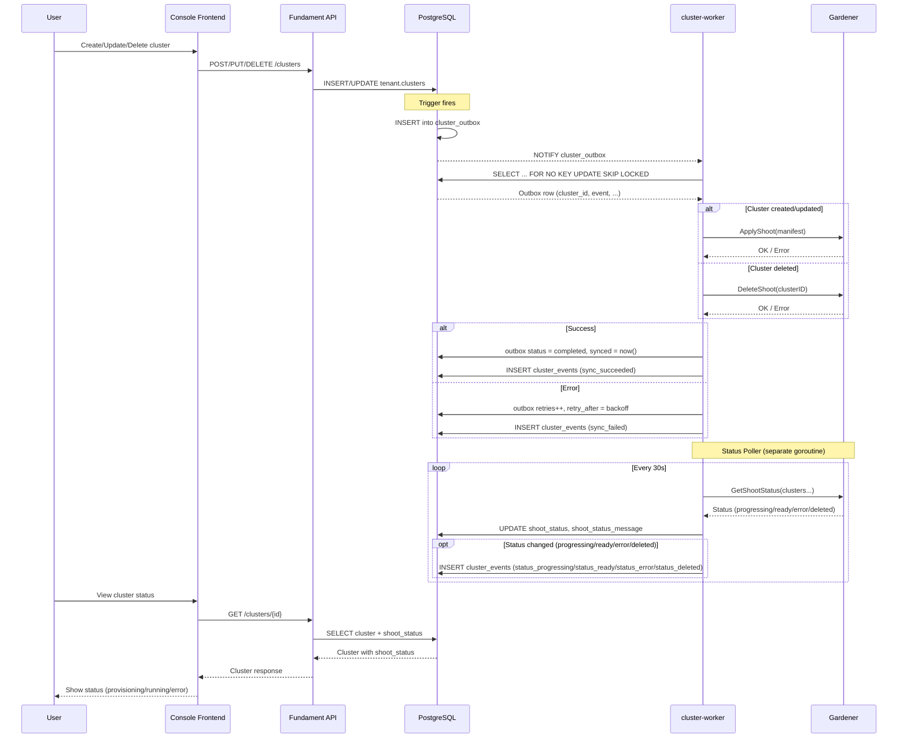
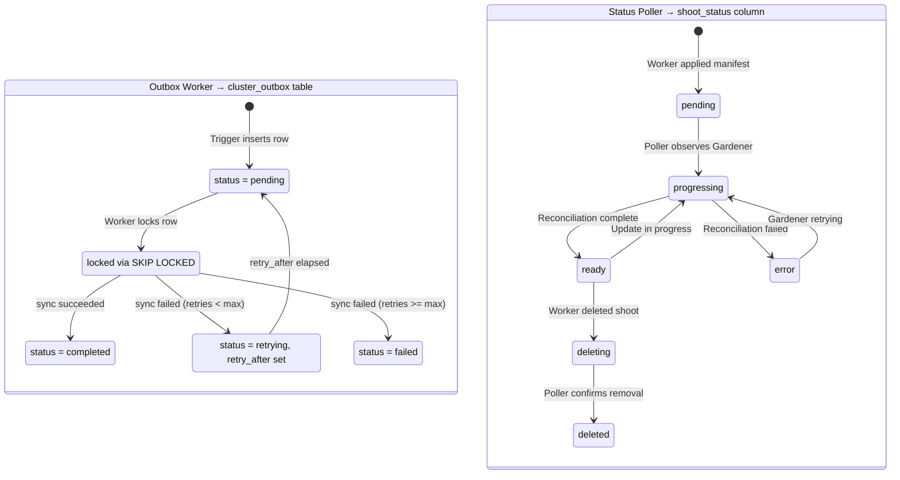

# cluster-worker

A background worker service that synchronizes cluster state from PostgreSQL to Gardener by creating, updating, and deleting Shoot cluster manifests.

## Terms

| Term | Description |
|------|-------------|
| **Gardener** | Kubernetes cluster management platform that provisions and manages clusters across cloud providers |
| **Shoot** | Gardener's term for a managed Kubernetes cluster (the workload cluster where applications run) |
| **Reconciliation** | Gardener's process of making the actual cluster state match the desired Shoot manifest |
| **Outbox** | A transactional outbox table (`tenant.cluster_outbox`) that decouples API writes from Gardener sync |

## What

The cluster-worker processes the `tenant.cluster_outbox` table and ensures that each entity change is synced to Gardener. It handles:

- **Clusters**: Create, update, or delete Shoots in Gardener
- **Namespaces**: Sync namespace state (stub, future scope)
- **Project members**: Sync project membership (stub, future scope)
- **Projects**: Cleanup on project deletion (stub, future scope)

The worker also monitors Gardener to track the reconciliation status of each Shoot (pending, progressing, ready, error) and stores this in the `shoot_status` column.

## Why

### Why not sync directly from the API?

Synchronous API calls to Gardener would make the user-facing API slow and fragile. Gardener operations can take minutes. By decoupling via a background worker:

- API responses are fast (just database writes)
- Retries happen automatically without user intervention
- Multiple workers can process clusters in parallel
- The system is resilient to Gardener downtime

### Why a transactional outbox?

Database triggers insert rows into `tenant.cluster_outbox` whenever relevant tables change. The worker picks up these rows and processes them. This pattern guarantees:

1. **No lost events** - Outbox inserts are part of the same transaction as the data change
2. **Exactly-once delivery** - `FOR NO KEY UPDATE SKIP LOCKED` ensures concurrent workers don't conflict
3. **Automatic retries** - Failed rows get exponential backoff via `retry_after`
4. **Periodic reconciliation** - Catches any drift between DB state and Gardener

### Why PostgreSQL LISTEN/NOTIFY?

We use PostgreSQL's built-in pub/sub mechanism instead of polling because:

1. **No additional infrastructure** - PostgreSQL is already required
2. **Low latency** - Worker wakes up immediately when new outbox rows are inserted
3. **Simplicity** - One less system to operate, monitor, and secure

The worker falls back to polling (`PollInterval`, default 5s) if notifications are missed.

### Why a separate status poller?

Gardener Shoot reconciliation is asynchronous - applying a manifest returns immediately, but the actual cluster creation takes minutes. A separate goroutine polls Gardener for status updates because:

- The outbox processing loop stays fast (just applies manifests)
- Users can see `shoot_status` to know if their cluster is actually ready
- We can detect and alert on failed reconciliations
- Deletion verification confirms Shoots are actually gone

## How

### Sequence Diagram



### State Diagram

The cluster-worker has two goroutines managing related but distinct state machines:

- **Outbox Worker**: Processes outbox rows and syncs entity state to Gardener
- **Status Poller**: Observes Gardener and writes shoot status back to the database



### Client Modes

The worker supports two Gardener client implementations:

| Mode | Use Case | Backend |
|------|----------|---------|
| `mock` | Unit/integration tests | In-memory map |
| `real` | Production + local Gardener | Gardener API |

### Event History

All sync and status changes are recorded in the `cluster_events` table for debugging and auditing:

| Event Type | Description |
|------------|-------------|
| `sync_succeeded` | Gardener accepted the Shoot manifest |
| `sync_failed` | Sync failed (with error message) |
| `status_progressing` | Shoot reconciliation in progress |
| `status_ready` | Shoot reconciliation completed successfully |
| `status_error` | Shoot reconciliation failed |
| `status_deleted` | Shoot confirmed deleted from Gardener |


## Quick Start: Full Local Development

Run the complete stack with local Gardener:

```bash
# 1. Start k3d cluster
just cluster-start

# 2. Start local Gardener (first time ~15 min)
just cluster-worker gardener-up

# 3. Deploy all services with local Gardener mode
just dev -p local-gardener

# 4. Access the console frontend
open http://console.fundament.localhost:8080

# 5. Create a test cluster via console or CLI:
just cluster-worker create-test-cluster t1

# Watch progress:
just cluster-worker shoots    # shoots in Gardener
just cluster-worker gardener-status # overall status
```

**Prerequisites:**
- Docker with 8+ CPUs and 8+ GB memory
- `mise trust && mise install` (installs all tools)
- macOS only: GNU tools (`brew install gnu-sed gnu-tar iproute2mac`)

**Pinned versions** (for team consistency):
- Gardener: `v1.117.0` (see `GARDENER_VERSION` in Justfile)
- Other tools: see `mise.toml`

**Skaffold profiles:**
- `just dev` → mock mode (no Gardener needed)
- `just dev -p local-gardener` → real local Gardener (requires step 2 first)

First Gardener run takes ~15 minutes to build. Subsequent runs are instant.
