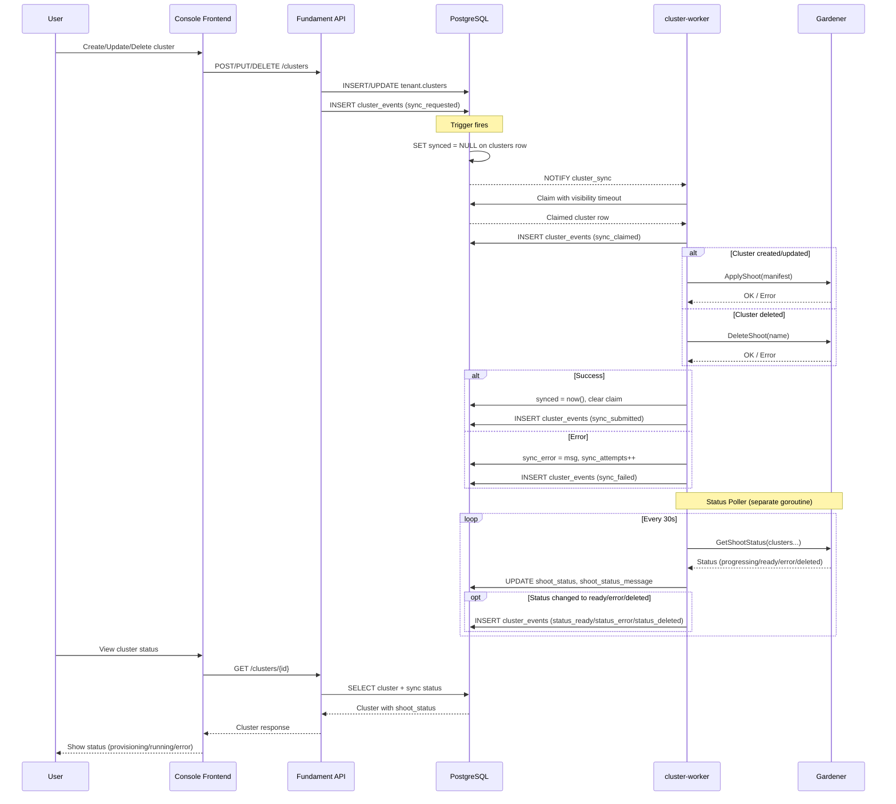
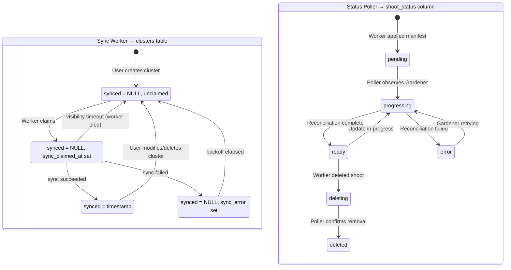

# cluster-worker

A background worker service that synchronizes cluster state from PostgreSQL to Gardener by creating, updating, and deleting Shoot cluster manifests.

## Terms

| Term | Description |
|------|-------------|
| **Gardener** | Kubernetes cluster management platform that provisions and manages clusters across cloud providers |
| **Shoot** | Gardener's term for a managed Kubernetes cluster (the workload cluster where applications run) |
| **Reconciliation** | Gardener's process of making the actual cluster state match the desired Shoot manifest |
| **Sync** | Pushing local database state (cluster definition) to Gardener as a Shoot manifest |

## What

The cluster-worker watches for changes to the `tenant.clusters` table and ensures that each cluster has a corresponding Shoot manifest in Gardener. It handles:

- **Creation**: When a new cluster is added to the database, create a Shoot in Gardener
- **Updates**: When cluster configuration changes, update the Shoot (future scope)
- **Deletion**: When a cluster is soft-deleted, delete the Shoot from Gardener

The worker also monitors Gardener to track the reconciliation status of each Shoot (pending, progressing, ready, error) and stores this in the `shoot_status` column.

## Why

### Why not sync directly from the API?

Synchronous API calls to Gardener would make the user-facing API slow and fragile. Gardener operations can take minutes. By decoupling via a background worker:

- API responses are fast (just database writes)
- Retries happen automatically without user intervention
- Multiple workers can process clusters in parallel
- The system is resilient to Gardener downtime

### Why PostgreSQL LISTEN/NOTIFY?

We use PostgreSQL's built-in pub/sub mechanism instead of a separate message queue (Redis, RabbitMQ, Kafka) because:

1. **No additional infrastructure** - PostgreSQL is already required
2. **Transactional guarantees** - Notifications are sent only when transactions commit
3. **Proven at scale** - This pattern handles hundreds of thousands of syncs per day at production systems like Printeers
4. **Simplicity** - One less system to operate, monitor, and secure

### Why SKIP LOCKED + Visibility Timeout?

The `SELECT ... FOR UPDATE SKIP LOCKED` pattern combined with a visibility timeout enables multiple workers to process clusters concurrently without conflicts:

- Workers grab available work without blocking each other
- Natural load distribution across workers
- No coordinator needed
- **Crash recovery**: If a worker dies mid-sync, the visibility timeout (10 min) allows another worker to reclaim the work
- **Exponential backoff**: Failed syncs wait 30s × 2^(attempts-1) before retry, capped at 15 minutes
- Each claim is tracked with `sync_claimed_at` and `sync_claimed_by` for debugging

### Why a separate status poller?

Gardener Shoot reconciliation is asynchronous - applying a manifest returns immediately, but the actual cluster creation takes minutes. A separate goroutine polls Gardener for status updates because:

- The main sync loop stays fast (just applies manifests)
- Users can see `shoot_status` to know if their cluster is actually ready
- We can detect and alert on failed reconciliations
- Deletion verification confirms Shoots are actually gone

## How

### Sequence Diagram



### State Diagram

The cluster-worker has two goroutines managing related but distinct state machines:

- **Sync Worker**: Pushes local database changes to Gardener (create/update/delete shoots)
- **Status Poller**: Observes Gardener and writes shoot status back to the database



### Client Modes

The worker supports two Gardener client implementations:

| Mode | Use Case | Backend |
|------|----------|---------|
| `mock` | Unit/integration tests | In-memory map |
| `real` | Production + local Gardener | Gardener API |

### Event History

All sync and status changes are recorded in the `cluster_events` table for debugging and auditing:

| Event Type | Description |
|------------|-------------|
| `sync_requested` | Cluster created/updated/deleted via API, needs sync |
| `sync_claimed` | Worker claimed the cluster for processing |
| `sync_submitted` | Gardener accepted the Shoot manifest |
| `sync_failed` | Sync failed (with error message and attempt count) |
| `status_ready` | Shoot reconciliation completed successfully |
| `status_error` | Shoot reconciliation failed |
| `status_deleted` | Shoot confirmed deleted from Gardener |


## Quick Start: Full Local Development

Run the complete stack with local Gardener:

```bash
# 1. Start k3d cluster
just cluster-start

# 2. Start local Gardener + configure secrets (first time ~15 min)
just local-gardener

# 3. Deploy all services with local Gardener mode
just dev -p local-gardener

# 4. Access the console frontend
open http://console.127.0.0.1.nip.io:8080

# 5. Create a test cluster via console or CLI:
cd cluster-worker && just create-test-cluster t1

# Watch progress:
cd cluster-worker && just logs            # cluster-worker logs
cd cluster-worker && just watch-shoots    # shoots in Gardener
cd cluster-worker && just gardener-status # overall status
```

**Prerequisites:**
- Docker with 8+ CPUs and 8+ GB memory
- `mise trust && mise install` (installs all tools)
- macOS only: GNU tools (`brew install gnu-sed gnu-tar iproute2mac`)

**Skaffold profiles:**
- `just dev` → mock mode (no Gardener needed)
- `just dev -p local-gardener` → real local Gardener (requires step 2 first)

First Gardener run takes ~15 minutes to build. Subsequent runs are instant.

