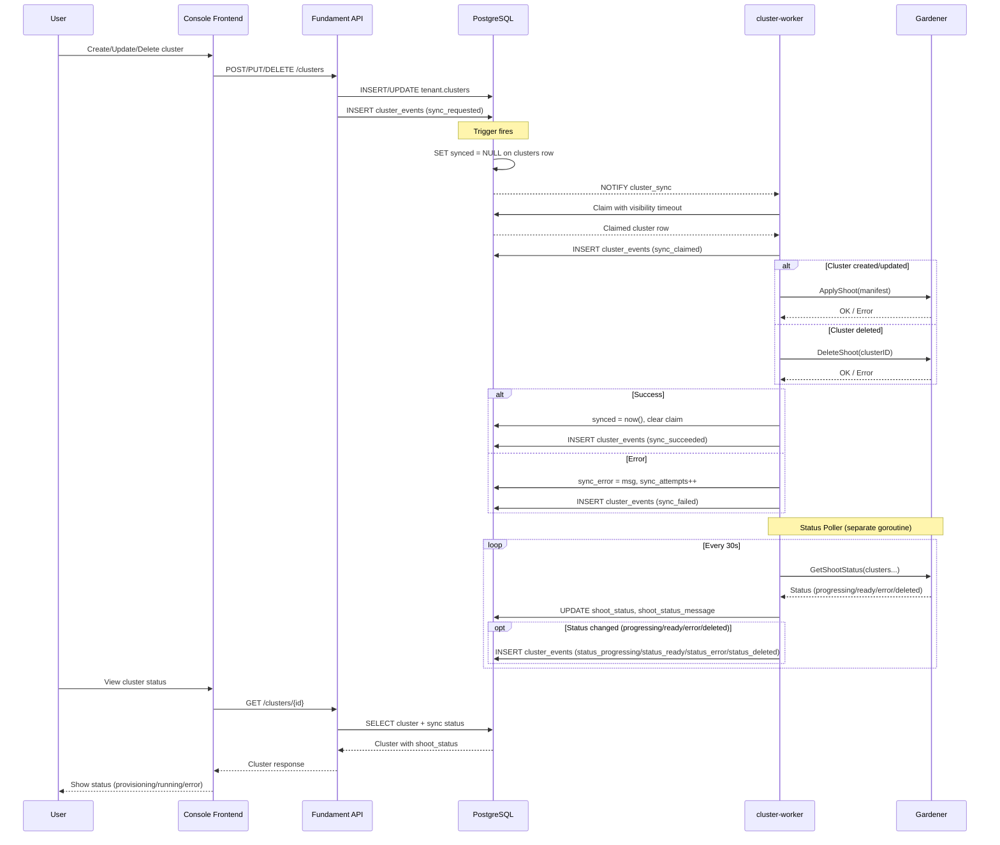
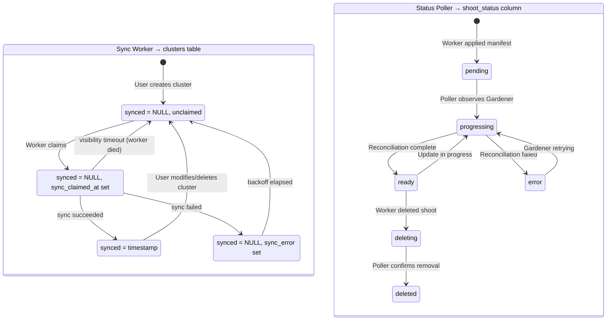

# cluster-worker

A background worker service that synchronizes cluster state from PostgreSQL to Gardener by creating, updating, and deleting Shoot cluster manifests.

## Terms

| Term | Description |
|------|-------------|
| **Gardener** | Kubernetes cluster management platform that provisions and manages clusters across cloud providers |
| **Shoot** | Gardener's term for a managed Kubernetes cluster (the workload cluster where applications run) |
| **Reconciliation** | Gardener's process of making the actual cluster state match the desired Shoot manifest |
| **Sync** | Pushing local database state (cluster definition) to Gardener as a Shoot manifest |

## What

The cluster-worker watches for changes to the `tenant.clusters` table and ensures that each cluster has a corresponding Shoot manifest in Gardener. It handles:

- **Creation**: When a new cluster is added to the database, create a Shoot in Gardener
- **Updates**: When cluster configuration changes, update the Shoot (future scope)
- **Deletion**: When a cluster is soft-deleted, delete the Shoot from Gardener

The worker also monitors Gardener to track the reconciliation status of each Shoot (pending, progressing, ready, error) and stores this in the `shoot_status` column.

## Why

### Why not sync directly from the API?

Synchronous API calls to Gardener would make the user-facing API slow and fragile. Gardener operations can take minutes. By decoupling via a background worker:

- API responses are fast (just database writes)
- Retries happen automatically without user intervention
- Multiple workers can process clusters in parallel
- The system is resilient to Gardener downtime

### Why PostgreSQL LISTEN/NOTIFY?

We use PostgreSQL's built-in pub/sub mechanism instead of a separate message queue (Redis, RabbitMQ, Kafka) because:

1. **No additional infrastructure** - PostgreSQL is already required
2. **Transactional guarantees** - Notifications are sent only when transactions commit
3. **Proven at scale** - This pattern handles hundreds of thousands of syncs per day at production systems like Printeers
4. **Simplicity** - One less system to operate, monitor, and secure

### Why SKIP LOCKED + Visibility Timeout?

The `SELECT ... FOR UPDATE SKIP LOCKED` pattern combined with a visibility timeout enables multiple workers to process clusters concurrently without conflicts:

- Workers grab available work without blocking each other
- Natural load distribution across workers
- No coordinator needed
- **Crash recovery**: If a worker dies mid-sync, the visibility timeout (10 min) allows another worker to reclaim the work
- **Exponential backoff**: Failed syncs wait 30s × 2^(attempts-1) before retry, capped at 15 minutes
- Each claim is tracked with `sync_claimed_at` and `sync_claimed_by` for debugging

### Why a separate status poller?

Gardener Shoot reconciliation is asynchronous - applying a manifest returns immediately, but the actual cluster creation takes minutes. A separate goroutine polls Gardener for status updates because:

- The main sync loop stays fast (just applies manifests)
- Users can see `shoot_status` to know if their cluster is actually ready
- We can detect and alert on failed reconciliations
- Deletion verification confirms Shoots are actually gone

## How

### Sequence Diagram


```mermaid
sequenceDiagram
    participant User
    participant Frontend as Console Frontend
    participant API as Fundament API
    participant DB as PostgreSQL
    participant Worker as cluster-worker
    participant Gardener

    User->>Frontend: Create/Update/Delete cluster
    Frontend->>API: POST/PUT/DELETE /clusters
    API->>DB: INSERT/UPDATE tenant.clusters
    API->>DB: INSERT cluster_events (sync_requested)

    Note over DB: Trigger fires
    DB->>DB: SET synced = NULL on clusters row
    DB-->>Worker: NOTIFY cluster_sync

    Worker->>DB: Claim with visibility timeout
    DB-->>Worker: Claimed cluster row
    Worker->>DB: INSERT cluster_events (sync_claimed)

    alt Cluster created/updated
        Worker->>Gardener: ApplyShoot(manifest)
        Gardener-->>Worker: OK / Error
    else Cluster deleted
        Worker->>Gardener: DeleteShoot(clusterID)
        Gardener-->>Worker: OK / Error
    end

    alt Success
        Worker->>DB: synced = now(), clear claim
        Worker->>DB: INSERT cluster_events (sync_succeeded)
    else Error
        Worker->>DB: sync_error = msg, sync_attempts++
        Worker->>DB: INSERT cluster_events (sync_failed)
    end

    Note over Worker,Gardener: Status Poller (separate goroutine)

    loop Every 30s
        Worker->>Gardener: GetShootStatus(clusters...)
        Gardener-->>Worker: Status (progressing/ready/error/deleted)
        Worker->>DB: UPDATE shoot_status, shoot_status_message
        opt Status changed (progressing/ready/error/deleted)
            Worker->>DB: INSERT cluster_events (status_progressing/status_ready/status_error/status_deleted)
        end
    end

    User->>Frontend: View cluster status
    Frontend->>API: GET /clusters/{id}
    API->>DB: SELECT cluster + sync status
    DB-->>API: Cluster with shoot_status
    API-->>Frontend: Cluster response
    Frontend-->>User: Show status (provisioning/running/error)
```

### State Diagram

The cluster-worker has two goroutines managing related but distinct state machines:

- **Sync Worker**: Pushes local database changes to Gardener (create/update/delete shoots)
- **Status Poller**: Observes Gardener and writes shoot status back to the database


```mermaid
stateDiagram-v2
    direction TB

    state "Sync Worker → clusters table" as db {
        [*] --> Pending: User creates cluster
        Synced --> Pending: User modifies/deletes cluster

        Pending --> Claimed: Worker claims
        Claimed --> Synced: sync succeeded
        Claimed --> Failed: sync failed
        Failed --> Pending: backoff elapsed
        Claimed --> Pending: visibility timeout (worker died)

        Pending: synced = NULL, unclaimed
        Claimed: synced = NULL, sync_claimed_at set
        Failed: synced = NULL, sync_error set
        Synced: synced = timestamp
    }

    state "Status Poller → shoot_status column" as poller {
        [*] --> Pending2: Worker applied manifest
        Pending2 --> Progressing: Poller observes Gardener
        Progressing --> Ready: Reconciliation complete
        Progressing --> Error: Reconciliation failed
        Error --> Progressing: Gardener retrying
        Ready --> Progressing: Update in progress
        Ready --> Deleting: Worker deleted shoot
        Deleting --> Deleted: Poller confirms removal

        Pending2: pending
        Progressing: progressing
        Ready: ready
        Error: error
        Deleting: deleting
        Deleted: deleted
    }
```

### Client Modes

The worker supports two Gardener client implementations:

| Mode | Use Case | Backend |
|------|----------|---------|
| `mock` | Unit/integration tests | In-memory map |
| `real` | Production + local Gardener | Gardener API |

### Event History

All sync and status changes are recorded in the `cluster_events` table for debugging and auditing:

| Event Type | Description |
|------------|-------------|
| `sync_requested` | Cluster created/updated/deleted via API, needs sync |
| `sync_claimed` | Worker claimed the cluster for processing |
| `sync_succeeded` | Gardener accepted the Shoot manifest |
| `status_progressing` | Shoot reconciliation in progress |
| `sync_failed` | Sync failed (with error message and attempt count) |
| `status_ready` | Shoot reconciliation completed successfully |
| `status_error` | Shoot reconciliation failed |
| `status_deleted` | Shoot confirmed deleted from Gardener |


## Quick Start: Full Local Development

Run the complete stack with local Gardener:

```bash
# 1. Start k3d cluster
just cluster-start

# 2. Start local Gardener (first time ~15 min)
just cluster-worker gardener-up

# 3. Deploy all services with local Gardener mode
just dev -p local-gardener

# 4. Access the console frontend
open http://console.fundament.localhost:10080

# 5. Create a test cluster via console or CLI:
just cluster-worker create-test-cluster t1

# Watch progress:
just cluster-worker shoots    # shoots in Gardener
just cluster-worker gardener-status # overall status
```

**Prerequisites:**
- Docker with 8+ CPUs and 8+ GB memory
- `mise trust && mise install` (installs all tools)
- macOS only: GNU tools (`brew install gnu-sed gnu-tar iproute2mac`)

**Pinned versions** (for team consistency):
- Gardener: `v1.117.0` (see `GARDENER_VERSION` in Justfile)
- Other tools: see `mise.toml`

**Skaffold profiles:**
- `just dev` → mock mode (no Gardener needed)
- `just dev -p local-gardener` → real local Gardener (requires step 2 first)
- `just dev -p minilab-gardener` → metal-stack Gardener via mini-lab (see below)

First Gardener run takes ~15 minutes to build. Subsequent runs are instant.

## mini-lab (metal-stack Gardener)

[mini-lab](https://github.com/metal-stack/mini-lab) provides a local bare-metal simulation with Gardener, letting you provision real Shoots on a metal-stack partition. This is useful for testing the full cluster lifecycle including provider-specific InfrastructureConfig and ControlPlaneConfig.

### Architecture

mini-lab runs a Kind cluster (`metal-control-plane`) that hosts both the metal-stack control plane and a Gardener installation. Gardener uses a **virtual garden** — a separate Kubernetes API server running inside the Kind cluster — to manage its resources (Seeds, CloudProfiles, Projects, Shoots). This virtual garden is not directly accessible from outside the Kind cluster.

```
┌─────────────────────────────────────────────────────────┐
│ Kind cluster (metal-control-plane)                      │
│                                                         │
│  ┌─────────────────┐  ┌──────────────────────────────┐  │
│  │ metal-api        │  │ Virtual Garden API            │  │
│  │ (ClusterIP:8080) │  │ (ClusterIP:443)               │  │
│  └─────────────────┘  └──────────────────────────────┘  │
│                                                         │
│  ┌─────────────────┐  ┌──────────────────────────────┐  │
│  │ nginx-ingress    │  │ extension-provider-metal      │  │
│  │ (port 8080)      │  │ (calls metal-api)             │  │
│  └─────────────────┘  └──────────────────────────────┘  │
│                                                         │
│  metal-api ingress: api.172.17.0.1.nip.io/metal/*       │
│  via nginx-ingress on port 8080                         │
└──────────────────────┬──────────────────────────────────┘
                       │ Docker network: k3d-fundament
┌──────────────────────┴──────────────────────────────────┐
│ k3d cluster (fundament)                                 │
│  ┌─────────────────┐                                    │
│  │ cluster-worker   │                                   │
│  │ → connects to    │                                   │
│  │   virtual garden │                                   │
│  │   via socat      │                                   │
│  │   proxy :30443   │                                   │
│  └─────────────────┘                                    │
└─────────────────────────────────────────────────────────┘
```

Key networking details:

- **Virtual garden API**: A ClusterIP service inside the Kind cluster (not exposed externally). We run a `socat` proxy on port 30443 inside the Kind container so k3d pods can reach it via the container's IP on the `k3d-fundament` Docker network.
- **metal-api**: Served by nginx-ingress at `http://api.172.17.0.1.nip.io:8080/metal/v1/...`. The `/metal` path prefix is required — the metal-api does not serve at `/v1/...` directly.
- **extension-provider-metal**: Runs as a pod on the Gardener seed inside the Kind cluster. It reads the metal-api URL from the `cloudprovider` secret (field `metalAPIURL`), which Gardener copies from the shoot's SecretBinding credentials. It reads the metal-api endpoint hostname from the CloudProfile's `providerConfig.metalControlPlanes.test.endpoint`.
- **nip.io**: mini-lab uses `172.17.0.1.nip.io` as a wildcard DNS domain. This resolves to `172.17.0.1` (the Docker bridge gateway). From within the Kind cluster, this IP is reachable through Docker's iptables rules on the ports that Kind exposes (8080, 4443, 6443) but **not** on port 443.

### Prerequisites

- Docker with 8+ CPUs and 16+ GB memory (mini-lab + k3d run simultaneously)
- [mini-lab](https://github.com/metal-stack/mini-lab) cloned (defaults to `.dev/mini-lab`, override with `MINILAB_DIR`)
- k3d cluster running (`just cluster-start`)

### Setup

```bash
# 1. Start mini-lab with Gardener flavor (in the mini-lab directory)
cd /path/to/mini-lab
MINI_LAB_FLAVOR=gardener make

# 2. Connect Docker networks, create secrets, and fix mini-lab configuration
just cluster-worker minilab-connect-k3d
just cluster-worker minilab-secret

# 3. Deploy with mini-lab Gardener profile
just dev -p minilab-gardener
```

The `minilab-secret` recipe handles all of the following automatically:
- Extracts the virtual garden kubeconfig from the Kind cluster
- Creates the `gardener-kubeconfig` secret in k3d for the cluster-worker
- Creates the `metal-credentials` secret in the virtual garden (with the correct `metalAPIURL` including the `/metal` path prefix)
- Patches the seed to be visible and removes the protected taint
- Fixes the cloud profile endpoint (see "Known mini-lab issues" below)
- Creates a Gardener Project (`test`) with SecretBinding

### Known mini-lab issues

mini-lab's Gardener flavor has configuration issues that prevent shoot creation out of the box. The `minilab-secret` recipe fixes these automatically, but they are documented here for reference.

#### Seed not schedulable

The seed is configured with `scheduling.visible: false` and a `seed.gardener.cloud/protected` taint. Without patching, the Gardener scheduler rejects all shoots with: `none of the 1 seeds is valid for scheduling`.

**Fix** (applied by `minilab-secret`):
```bash
kubectl patch seed local --type=merge \
  -p '{"spec":{"settings":{"scheduling":{"visible":true}},"taints":[]}}'
```

#### Cloud profile endpoint misconfigured

The cloud profile endpoint is set to `https://api.172.17.0.1.nip.io`. This is wrong for two reasons:

- **Wrong protocol and port**: HTTPS on port 443. Nothing listens on 443; the nginx-ingress serves on port 8080 over plain HTTP.
- **Missing path prefix**: The metal-api is served under `/metal/`. The extension-provider-metal appends `/v1/...` to the endpoint, so the endpoint must include `/metal` for the paths to be correct (e.g. `{endpoint}/v1/ip/find` becomes `http://....:8080/metal/v1/ip/find`).

The symptom is the infrastructure resource getting stuck with `context deadline exceeded` (port 443 unreachable) or `endpoint did not return a json response` with an nginx 404 (correct port but wrong path).

**Fix** (applied by `minilab-secret`):
```bash
kubectl get cloudprofile metal -o json | \
  jq '.spec.providerConfig.metalControlPlanes.test.endpoint = "http://api.172.17.0.1.nip.io:8080/metal"' | \
  kubectl apply -f -
```

#### No Gardener project

mini-lab sets up the Gardener infrastructure (seed, cloud profile, extensions) but does not create a project namespace for shoot creation.

**Fix** (applied by `minilab-secret`): Creates project `test` (namespace `garden-test`), copies the `metal-credentials` secret into it, and creates a SecretBinding.

### Shoot spec requirements

The metal-stack admission webhook and Gardener scheduler enforce requirements on Shoots that are not obvious from the Gardener documentation alone:

- **Tenant annotation** (required): Shoots must have `cluster.metal-stack.io/tenant` in metadata annotations. Without this, the admission webhook rejects the shoot with: `cluster must be annotated with a tenant`.
- **No worker zones** (required): The metal provider does not support zone spreading. Do not specify `zones` on workers. The partition is specified via `partitionID` in the InfrastructureConfig instead. Error: `zone spreading is not supported, specify partition via infrastructure config`.
- **Correct apiVersion** (required): InfrastructureConfig and ControlPlaneConfig must use `metal.provider.extensions.gardener.cloud/v1alpha1`. The older `metal.gardener.cloud/v1alpha1` is not registered and will be rejected.
- **Deletion annotation**: Deleting a shoot requires adding the `confirmation.gardener.cloud/deletion: "true"` annotation first.

Example minimal Shoot:

```yaml
apiVersion: core.gardener.cloud/v1beta1
kind: Shoot
metadata:
  name: test1
  namespace: garden-test
  annotations:
    cluster.metal-stack.io/tenant: test
spec:
  cloudProfileName: metal
  secretBindingName: metal-credentials
  region: local
  provider:
    type: metal
    infrastructureConfig:
      apiVersion: metal.provider.extensions.gardener.cloud/v1alpha1
      kind: InfrastructureConfig
      firewall:
        size: v1-small-x86
        image: firewall-ubuntu-3.0
        networks:
          - internet-mini-lab
      projectID: "00000000-0000-0000-0000-000000000001"
      partitionID: mini-lab
    controlPlaneConfig:
      apiVersion: metal.provider.extensions.gardener.cloud/v1alpha1
      kind: ControlPlaneConfig
    workers:
      - name: worker1
        minimum: 1
        maximum: 1
        machine:
          type: v1-small-x86
          image:
            name: ubuntu
            version: "24.4"
  networking:
    type: calico
    pods: 10.250.0.0/16
    services: 10.251.0.0/16
    nodes: 10.252.0.0/16
  kubernetes:
    version: "1.30.8"
  purpose: evaluation
```

### Creating a test cluster

```bash
# Insert a cluster row with the mini-lab region
just cluster-worker create-test-cluster-metal t1

# Watch Shoot creation progress
just cluster-worker shoots
```

### Checking status

```bash
# Check network connectivity and Gardener health
just cluster-worker minilab-status
```

### Configuration

The mini-lab values are in `charts/fundament/values-minilab.yaml`:

| Value | Default | Description |
|-------|---------|-------------|
| `gardenerProviderType` | `metal` | Gardener provider type |
| `gardenerCloudProfile` | `metal` | CloudProfile name |
| `gardenerCredentialsBindingName` | `metal-credentials` | SecretBinding name in the project namespace |
| `gardenerCredentialsSecretRef` | `garden/metal-secret` | Namespace/name of the credentials secret |
| `gardenerMachineImageName` | `ubuntu` | OS image (from CloudProfile `.spec.machineImages`) |
| `gardenerMachineImageVersion` | `24.4` | OS image version |
| `gardenerDefaultMachineType` | `v1-small-x86` | Machine type (from CloudProfile `.spec.machineTypes`) |
| `gardenerNetworkingType` | `calico` | CNI plugin |
| `gardenerInfrastructureConfig` | *(JSON)* | Raw InfrastructureConfig with partition, firewall, projectID |
| `gardenerControlPlaneConfig` | *(JSON)* | Raw ControlPlaneConfig (minimal for metal) |

These values were determined by inspecting the running mini-lab's CloudProfile (`kubectl get cloudprofile metal -o yaml`).

### Troubleshooting

**"none of the 1 seeds is valid for scheduling"**
The seed needs to be made visible and have its protected taint removed. See step 1 of "Required manual fixes".

**Infrastructure stuck with "context deadline exceeded" to `https://api.172.17.0.1.nip.io`**
The cloud profile endpoint is misconfigured. Nothing listens on HTTPS port 443. Patch it to `http://api.172.17.0.1.nip.io:8080/metal`. See step 2 of "Required manual fixes".

**Infrastructure error "endpoint did not return a json response" (nginx 404)**
The `metalAPIURL` in the credentials secret is missing the `/metal` path prefix. The metal-api serves at `/metal/v1/...`, not `/v1/...`. Ensure the URL ends with `/metal`. The `minilab-secret` recipe sets this correctly; if you created the secret manually, check the URL.

**"tenant not allowed" from metal-api**
The HMAC credentials in the secret may be wrong, or the metal-api tenant configuration doesn't match the `cluster.metal-stack.io/tenant` annotation. Check the `metalAPIHMac` value in the credentials secret against the `admin_key` in the `metal-api` secret in the `metal-control-plane` namespace.

**"mini-lab network not found"**
mini-lab isn't running. Start it with `MINI_LAB_FLAVOR=gardener make` in the mini-lab directory.

**kubeconfig secret not working / "no route to host"**
The socat proxy or Docker network connection was lost (e.g. after a mini-lab or k3d restart). Re-run:
```bash
just cluster-worker minilab-connect-k3d
just cluster-worker minilab-secret
```
