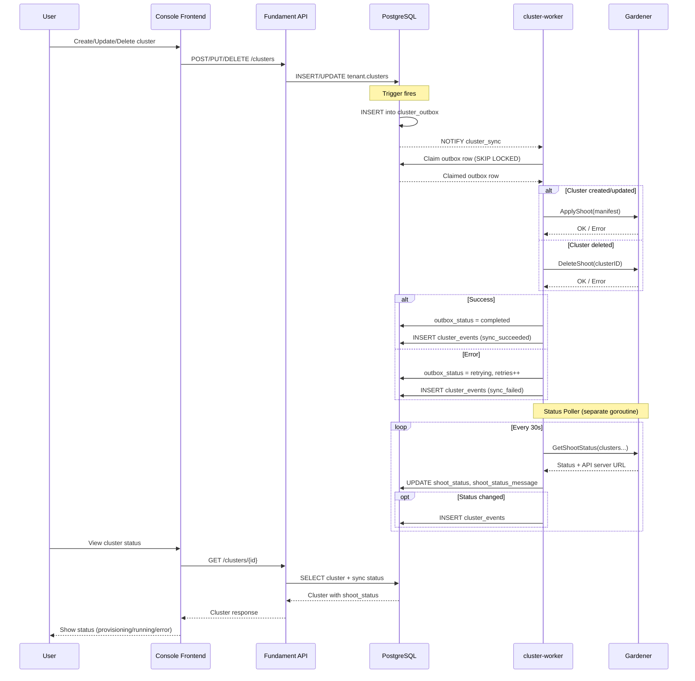
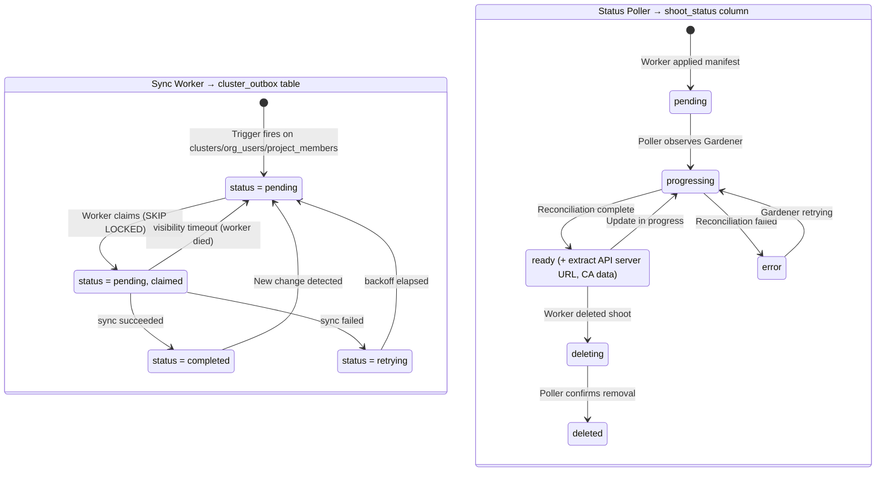

# cluster-worker

A background worker service that synchronizes cluster state from PostgreSQL to Gardener by creating, updating, and deleting Shoot cluster manifests.

## Terms

| Term | Description |
|------|-------------|
| **Gardener** | Kubernetes cluster management platform that provisions and manages clusters across cloud providers |
| **Shoot** | Gardener's term for a managed Kubernetes cluster (the workload cluster where applications run) |
| **Reconciliation** | Gardener's process of making the actual cluster state match the desired Shoot manifest |
| **Sync** | Pushing local database state (cluster definition) to Gardener as a Shoot manifest |

## What

The cluster-worker watches for changes to the `tenant.clusters` table and ensures that each cluster has a corresponding Shoot manifest in Gardener. It handles:

- **Creation**: When a new cluster is added to the database, create a Shoot in Gardener
- **Updates**: When cluster configuration changes, update the Shoot (future scope)
- **Deletion**: When a cluster is soft-deleted, delete the Shoot from Gardener

The worker also monitors Gardener to track the reconciliation status of each Shoot (pending, progressing, ready, error) and stores this in the `shoot_status` column. When a shoot becomes ready, the worker triggers user sync to create per-user service accounts on the cluster.

The `tenant.cluster_outbox` table also tracks changes to `organizations_users` and `project_members` via database triggers, laying the groundwork for a future UserSyncHandler that will reconcile service accounts and RBAC on shoot clusters.

## Why

### Why not sync directly from the API?

Synchronous API calls to Gardener would make the user-facing API slow and fragile. Gardener operations can take minutes. By decoupling via a background worker:

- API responses are fast (just database writes)
- Retries happen automatically without user intervention
- Multiple workers can process clusters in parallel
- The system is resilient to Gardener downtime

### Why PostgreSQL LISTEN/NOTIFY?

We use PostgreSQL's built-in pub/sub mechanism instead of a separate message queue (Redis, RabbitMQ, Kafka) because:

1. **No additional infrastructure** - PostgreSQL is already required
2. **Transactional guarantees** - Notifications are sent only when transactions commit
3. **Proven at scale** - This pattern handles hundreds of thousands of syncs per day at production systems like Printeers
4. **Simplicity** - One less system to operate, monitor, and secure

### Why SKIP LOCKED + Visibility Timeout?

The `SELECT ... FOR UPDATE SKIP LOCKED` pattern combined with a visibility timeout enables multiple workers to process clusters concurrently without conflicts:

- Workers grab available work without blocking each other
- Natural load distribution across workers
- No coordinator needed
- **Crash recovery**: If a worker dies mid-sync, the visibility timeout (10 min) allows another worker to reclaim the work
- **Exponential backoff**: Failed syncs wait 30s × 2^(attempts-1) before retry, capped at 15 minutes
- Each claim is tracked with `sync_claimed_at` and `sync_claimed_by` for debugging

### Why a separate status poller?

Gardener Shoot reconciliation is asynchronous - applying a manifest returns immediately, but the actual cluster creation takes minutes. A separate goroutine polls Gardener for status updates because:

- The main sync loop stays fast (just applies manifests)
- Users can see `shoot_status` to know if their cluster is actually ready
- We can detect and alert on failed reconciliations
- Deletion verification confirms Shoots are actually gone
- Connection data (API server URL, CA cert) is extracted when a shoot becomes ready, enabling kubeconfig generation

## How

### Sequence Diagram


```mermaid
sequenceDiagram
    participant User
    participant Frontend as Console Frontend
    participant API as Fundament API
    participant DB as PostgreSQL
    participant Worker as cluster-worker
    participant Gardener

    User->>Frontend: Create/Update/Delete cluster
    Frontend->>API: POST/PUT/DELETE /clusters
    API->>DB: INSERT/UPDATE tenant.clusters

    Note over DB: Trigger fires
    DB->>DB: INSERT into cluster_outbox
    DB-->>Worker: NOTIFY cluster_sync

    Worker->>DB: Claim outbox row (SKIP LOCKED)
    DB-->>Worker: Claimed outbox row

    alt Cluster created/updated
        Worker->>Gardener: ApplyShoot(manifest)
        Gardener-->>Worker: OK / Error
    else Cluster deleted
        Worker->>Gardener: DeleteShoot(clusterID)
        Gardener-->>Worker: OK / Error
    end

    alt Success
        Worker->>DB: outbox_status = completed
        Worker->>DB: INSERT cluster_events (sync_succeeded)
    else Error
        Worker->>DB: outbox_status = retrying, retries++
        Worker->>DB: INSERT cluster_events (sync_failed)
    end

    Note over Worker,Gardener: Status Poller (separate goroutine)

    loop Every 30s
        Worker->>Gardener: GetShootStatus(clusters...)
        Gardener-->>Worker: Status + API server URL
        Worker->>DB: UPDATE shoot_status, shoot_status_message
        opt Status changed
            Worker->>DB: INSERT cluster_events
        end
    end

    User->>Frontend: View cluster status
    Frontend->>API: GET /clusters/{id}
    API->>DB: SELECT cluster + sync status
    DB-->>API: Cluster with shoot_status
    API-->>Frontend: Cluster response
    Frontend-->>User: Show status (provisioning/running/error)
```

### State Diagram

The cluster-worker has two goroutines managing related but distinct state machines:

- **Sync Worker**: Pushes local database changes to Gardener (create/update/delete shoots)
- **Status Poller**: Observes Gardener and writes shoot status back to the database


```mermaid
stateDiagram-v2
    direction TB

    state "Sync Worker → cluster_outbox table" as db {
        [*] --> Pending: Trigger fires on clusters/org_users/project_members
        Completed --> Pending: New change detected

        Pending --> InProgress: Worker claims (SKIP LOCKED)
        InProgress --> Completed: sync succeeded
        InProgress --> Retrying: sync failed
        Retrying --> Pending: backoff elapsed
        InProgress --> Pending: visibility timeout (worker died)

        Pending: status = pending
        InProgress: status = pending, claimed
        Retrying: status = retrying
        Completed: status = completed
    }

    state "Status Poller → shoot_status column" as poller {
        [*] --> Pending2: Worker applied manifest
        Pending2 --> Progressing: Poller observes Gardener
        Progressing --> Ready: Reconciliation complete
        Progressing --> Error: Reconciliation failed
        Error --> Progressing: Gardener retrying
        Ready --> Progressing: Update in progress
        Ready --> Deleting: Worker deleted shoot
        Deleting --> Deleted: Poller confirms removal

        Pending2: pending
        Progressing: progressing
        Ready: ready (+ extract API server URL, CA data)
        Error: error
        Deleting: deleting
        Deleted: deleted
    }
```

### Client Modes

The worker supports two Gardener client implementations:

| Mode | Use Case | Backend |
|------|----------|---------|
| `mock` | Unit/integration tests | In-memory map |
| `real` | Production + local Gardener | Gardener API |

### Event History

All sync and status changes are recorded in the `cluster_events` table for debugging and auditing:

| Event Type | Description |
|------------|-------------|
| `sync_requested` | Cluster created/updated/deleted via API, needs sync |
| `sync_claimed` | Worker claimed the cluster for processing |
| `sync_succeeded` | Gardener accepted the Shoot manifest |
| `sync_failed` | Sync failed (with error message and attempt count) |
| `status_progressing` | Shoot reconciliation in progress |
| `status_ready` | Shoot reconciliation completed successfully |
| `status_error` | Shoot reconciliation failed |
| `status_deleted` | Shoot confirmed deleted from Gardener |

### Outbox Sources

The `cluster_outbox` table tracks changes from multiple sources:

| Source | Trigger |
|--------|---------|
| `trigger` | Database trigger on `clusters`, `organizations_users`, `project_members`, `node_pools`, `namespaces`, `organization_limits` (node-cap change → `cluster_id` rows; `default_*` change → `namespace_id` rows), or `project_limits` (`default_*` change → `namespace_id` rows) |
| `reconcile` | Periodic reconciliation loop |
| `manual` | Manual intervention |
| `node_pool` | Node pool configuration change |
| `status` | Status poller detected a state change |

### Organization Limits Enforcement

The Limits page values are enforced by the cluster-worker:

- **Node caps** (`tenant.organization_limits`) are applied at Shoot apply time.
  `max_nodes_per_node_pool` clamps each worker pool's autoscaler maximum (the
  minimum is lowered too when needed). `max_node_pools_per_cluster` and
  `max_nodes_per_cluster` have no Gardener field: when exceeded, the sync fails
  with a descriptive error in `cluster_outbox.status_info` instead of silently
  shrinking or dropping pools. NULL caps (or no limits row) mean unlimited.
- **Per-container resource defaults** (`organization_limits`/`project_limits`
  `default_*` columns) are materialized as a managed `fundament-defaults`
  `LimitRange` in each project namespace during namespace sync. Per field the
  lowest of the org and project value wins, so a project can only tighten the
  org default; when no defaults apply the managed `LimitRange` is removed. A
  mixed-NULL combination where a merged request exceeds the merged limit fails
  the namespace sync visibly rather than applying an object the kube-apiserver
  would reject.

Write-time validation of limit values (rejecting e.g. an `autoscale_max` above
the org cap when it is set) is an org-api concern and intentionally not handled
here — the cluster-worker is the materialization/backstop layer.

### Plugin Machinery Provisioning

The console installs plugins by writing `PluginInstallation` CRs directly onto
the target shoot (via kube-api-proxy). For those CRs to do anything, the shoot
needs the plugin substrate: the CRD and a running plugin-controller. The
`pluginmachinery` handler provisions both onto every ready shoot — triggered by
the cluster-ready outbox event and re-asserted by the periodic reconcile loop,
so hand-deleted resources heal within one reconcile interval.

What lands on each shoot:

| Resource | Name | Notes |
|----------|------|-------|
| CRD | `plugininstallations.plugins.fundament.io` | Embedded copy of `charts/fundament/crds/`, refreshed by `just generate`; updates in place, so this is also the CRD upgrade channel for shoots (Helm only applies `crds/` at install) |
| Namespace | `fundament-system` | Shared with usersync |
| ServiceAccount | `plugin-controller` | In `fundament-system` |
| ClusterRole + Binding | `fundament:plugin-controller` | Rules mirror the chart's plugin-controller role; a unit test fails on drift |
| Deployment | `plugin-controller` | Real per-shoot env: `FUNDAMENT_CLUSTER_ID` (cluster UUID, also stands in for `FUNDAMENT_INSTALL_ID`), `FUNDAMENT_ORGANIZATION_ID` (from `tenant.clusters`), `MARKETPLACE_CATALOG_API_URL` (external, FUN-19) |

Configuration (all under the `PLUGIN_` env prefix; Helm wires them from
`pluginController.shootImage` + `externalUrls.marketplaceCatalogApi`):

| Env | Meaning |
|-----|---------|
| `PLUGIN_CONTROLLER_IMAGE` | plugin-controller image, **pullable from shoot nodes** |
| `PLUGIN_MARKETPLACE_CATALOG_API_URL` | externally routable marketplace-catalog-api base URL |
| `PLUGIN_LOG_LEVEL` | shoot-side controller log level |
| `PLUGIN_ALLOW_UNPINNED_HASH` | skip the definition-hash gate — local dev only |

When image or URL is unset the handler no-ops (one log line per process), so
mock-Gardener and PR environments need no configuration.

#### Verifying on a real shoot

Run this end-to-end check whenever the machinery or the CRD changes (it is
deliberately not CI — see the repo's testing conventions):

1. Deploy with real Gardener and set `pluginController.shootImage` to an image
   the shoot nodes can pull, plus a shoot-reachable `externalUrls.organization`.
   For local Gardener setups the plugin sandbox's NodePort/socat relay
   (`just plugins sandbox-up`, `plugins/Justfile`) is the reference for making
   org-api reachable from another cluster.
2. Create a cluster in the console and wait until it is ready. Against the
   shoot's admin kubeconfig:
   `kubectl get crd plugininstallations.plugins.fundament.io` and
   `kubectl -n fundament-system get deploy plugin-controller` — the Deployment
   must become Ready and its env must carry the cluster's real UUIDs.
3. Publish a plugin to a registry the shoot can pull from
   (`PLUGIN_REGISTRY=… just plugins plugin-publish cert-manager`), install it
   from the console, and confirm the `PluginInstallation` reaches `Running`.
4. Heal check: `kubectl -n fundament-system delete deploy plugin-controller`
   and confirm the reconcile loop (5 min) restores it.

#### Disabling is not uninstalling

Clearing `pluginController.shootImage` stops the handler from provisioning or
updating the machinery, but removes nothing: already-provisioned shoots keep
running the plugin-controller Deployment with its ClusterRole, and the CRD
stays installed. A per-cluster opt-out with a full, ordered teardown (drain
`PluginInstallation`s through the still-running controller, then the CRD, then
the controller and its RBAC) is designed and tracked as a follow-up issue.
Until it lands, removing the machinery from a shoot is a manual operation in
exactly that order — deleting the controller first strands the CRs behind
their cleanup finalizer.

#### Retiring a CRD version

`EnsureCRD` converges each shoot's CRD onto the manifest embedded in the
binary, but it will not drop a version the shoot still stores objects under.
Kubernetes rejects such an update outright, and because the handler runs on
every ready shoot, a chart revision that removed a stored version would fail
fleet-wide on every tick. Instead the handler refuses that one update and logs:

```
refusing CRD update that would drop stored versions
  crd=plugininstallations.plugins.fundament.io removed_stored_versions=[v1]
```

If you see that, the chart is ahead of the shoots. Retire the version properly
([upstream procedure][crd-versioning]):

1. Ship the new version **alongside** the old one and make it `storage: true`.
2. Migrate the stored objects, so nothing remains persisted under the old
   version — Kubernetes' [StorageVersionMigration][svm] does this, or touch
   every `PluginInstallation` so the API server rewrites it.
3. Confirm the old version has left `status.storedVersions` on each shoot:
   `kubectl get crd plugininstallations.plugins.fundament.io -o jsonpath='{.status.storedVersions}'`
4. Only then remove the version from `charts/fundament/crds/` and re-run
   `go generate ./cluster-worker/...` so the embedded copy follows.

Never "fix" this by deleting the CRD: that cascades to every tenant's
`PluginInstallation` resources.

[crd-versioning]: https://kubernetes.io/docs/tasks/extend-kubernetes/custom-resources/custom-resource-definition-versioning/#upgrade-existing-objects-to-a-new-stored-version
[svm]: https://kubernetes.io/docs/tasks/manage-kubernetes-objects/storage-version-migration/

## Quick Start: Full Local Development

Run the complete stack with local Gardener (gardener-operator path):

```bash
# 1. Start k3d cluster
just cluster-start

# 2. Start local Gardener via gardener-operator (first time ~15 min)
just cluster-worker gardener-up

# 3. Deploy all services with local Gardener mode
just dev -p local-gardener

# 4. Access the console frontend
open http://console.fundament.localhost:8080

# 5. Create a test cluster via the console (http://console.fundament.localhost:8080)

# Watch progress:
just cluster-worker shoots    # shoots in Gardener
just cluster-worker logs      # cluster-worker logs
just cluster-worker gardener-status # overall status
```

**Troubleshooting:**
```bash
# Re-connect Docker networks (if k3d can't reach Gardener after restart)
just cluster-worker gardener-connect

# Re-create the kubeconfig secret (if cluster-worker can't authenticate to Gardener)
just cluster-worker gardener-secret
```

**Prerequisites:**
- Docker with 8+ CPUs and 8+ GB memory
- `mise trust && mise install` (installs all tools)
- macOS only: GNU tools (`brew install gnu-sed gnu-tar iproute2mac`)

**Pinned versions** (for team consistency):
- Gardener: `v1.138.0` (see `GARDENER_VERSION` in mod.just)
- Other tools: see `mise.toml`

**Skaffold profiles:**
- `just dev` → mock mode (no Gardener needed)
- `just dev -p local-gardener` → real local Gardener (requires step 2 first)

First Gardener run takes ~15 minutes to build. Subsequent runs are instant.
