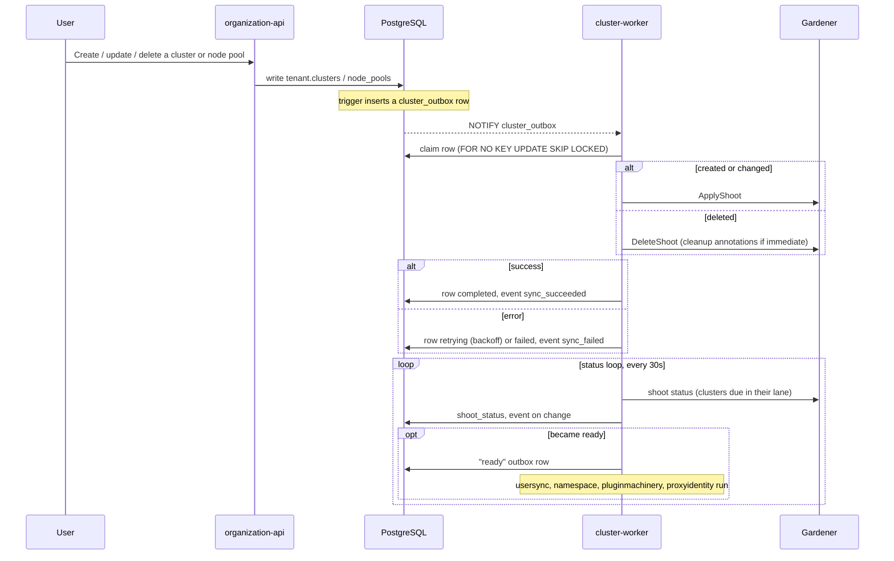
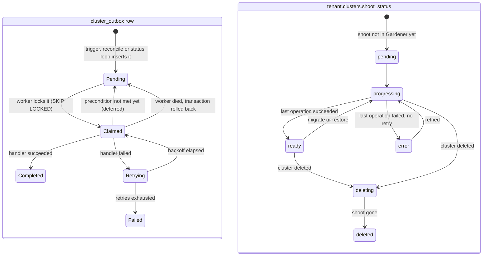

# cluster-worker

Keeps Gardener in line with the database. The APIs only write rows; cluster-worker turns
them into Gardener Shoots and shoot-side resources, and writes each shoot's status back.
Gardener operations take minutes, so none of this happens inside an API request.

A *shoot* is a cluster Gardener manages. Every fundament cluster has one, labelled
`fundament.io/cluster-id` with the cluster's ID.

## Handlers

| Handler | Runs on | Does |
|---|---|---|
| `cluster` | cluster and node pool changes; status loop; reconcile | creates, updates and deletes the Shoot; tracks `shoot_status`; deletes orphaned shoots |
| `usersync` | organization member and project member changes; cluster ready; reconcile | per-user ServiceAccounts and RBAC on the shoot |
| `namespace` | namespace changes; cluster ready; reconcile | Namespaces and the `fundament-defaults` LimitRange on the shoot |
| `pluginmachinery` | cluster ready; reconcile | the plugin CRD and plugin-controller on the shoot, see [Plugin machinery](#plugin-machinery) |
| `proxyidentity` | cluster ready; reconcile | the ServiceAccount and impersonation RBAC kube-api-proxy uses on the shoot |

Handlers are registered in `pkg/app/app.go`.

## How it works


```mermaid
sequenceDiagram
    participant User
    participant API as organization-api
    participant DB as PostgreSQL
    participant Worker as cluster-worker
    participant Gardener

    User->>API: Create / update / delete a cluster or node pool
    API->>DB: write tenant.clusters / node_pools
    Note over DB: trigger inserts a cluster_outbox row
    DB-->>Worker: NOTIFY cluster_outbox

    Worker->>DB: claim row (FOR NO KEY UPDATE SKIP LOCKED)
    alt created or changed
        Worker->>Gardener: ApplyShoot
    else deleted
        Worker->>Gardener: DeleteShoot (cleanup annotations if immediate)
    end
    alt success
        Worker->>DB: row completed, event sync_succeeded
    else error
        Worker->>DB: row retrying (backoff) or failed, event sync_failed
    end

    loop status loop, every 30s
        Worker->>Gardener: shoot status (clusters due in their lane)
        Worker->>DB: shoot_status, event on change
        opt became ready
            Worker->>DB: "ready" outbox row
            Note over Worker: usersync, namespace, pluginmachinery, proxyidentity run
        end
    end
```

- **Outbox worker.** Database triggers on clusters, node pools, namespaces, members and
  limits insert `cluster_outbox` rows and notify the `cluster_outbox` channel. The worker
  claims one row at a time with `FOR NO KEY UPDATE SKIP LOCKED`, so several replicas can
  run. A failed sync is retried with exponential backoff up to `OUTBOX_MAX_RETRIES`; a row
  whose precondition is not met yet (for example, the project namespace does not exist)
  is deferred instead of failed.
- **Status loop.** Every `STATUS_INTERVAL` (30s) it checks one batch of
  `CLUSTER_STATUS_BATCH_SIZE` clusters, in two lanes: every 30s for clusters that are new,
  `pending`, `progressing` or in `error`, and for ready clusters whose health is not known
  to be healthy yet; every `CLUSTER_STATUS_READY_INTERVAL` (5m) for healthy ready
  clusters. Clusters still being created are ordered first, so ready clusters never delay
  them. Deleted clusters are polled until their shoot is gone. The loop only queues
  the clusters that are due; `CLUSTER_STATUS_WORKERS` workers take them off the queue
  and check one cluster at a time each. A cluster queued twice is checked once, never by
  two workers at the same time, and a failed check is retried with backoff. Each check
  writes the status, its events and the ready outbox row in one transaction. See
  [Ready clusters](#ready-clusters).
- **Reconcile loop.** Every 5 minutes it re-enqueues clusters whose shoot is missing,
  deletes shoots whose cluster is gone, and lets the shoot-side handlers re-assert their
  resources.

## Cluster status

Two state machines: the outbox row a change produces, and the cluster's `shoot_status`
as the console shows it.


```mermaid
stateDiagram-v2
    direction TB

    state "cluster_outbox row" as outbox {
        [*] --> Pending: trigger, reconcile or status loop inserts it
        Pending --> Claimed: worker locks it (SKIP LOCKED)
        Claimed --> Completed: handler succeeded
        Claimed --> Retrying: handler failed
        Claimed --> Pending: precondition not met yet (deferred)
        Claimed --> Pending: worker died, transaction rolled back
        Retrying --> Claimed: backoff elapsed
        Retrying --> Failed: retries exhausted
    }

    state "tenant.clusters.shoot_status" as status {
        [*] --> pending: shoot not in Gardener yet
        pending --> progressing
        progressing --> ready: last operation succeeded
        progressing --> error: last operation failed, no retry
        error --> progressing: retried
        ready --> progressing: migrate or restore
        ready --> deleting: cluster deleted
        progressing --> deleting: cluster deleted
        deleting --> deleted: shoot gone
    }
```

`tenant.clusters.shoot_status`, as the console shows it:

| Status | Meaning |
|---|---|
| `pending` | no shoot in Gardener yet |
| `progressing` | Gardener is creating or changing the shoot |
| `ready` | the last operation succeeded; `shoot_health` says whether all conditions are healthy |
| `error` | the last operation failed and Gardener will not retry it by itself |
| `deleting` | the cluster is deleted, the shoot is going away |
| `deleted` | the shoot is gone |

Changes are recorded in `tenant.cluster_events`: `sync_succeeded` / `sync_failed` per
outbox row, `status_progressing` / `status_ready` / `status_error` / `status_deleted` on a
status change, `status_healthy` / `status_unhealthy` when a ready cluster's health
changes, `status_warning` for an error Gardener retries by itself, `status_lost` when a
shoot fundament had seen is no longer in Gardener (the reconcile loop recreates it), and
`user_sync_succeeded` / `user_sync_failed` from usersync.

### Ready clusters

Ready clusters keep being polled, so a message recorded while conditions were still
settling does not stick, and a cluster that breaks later shows it.

- Gardener reconciles every shoot periodically (gardenlet `syncPeriod`, 1h by default).
  A `Reconcile` fundament did not start keeps the cluster `ready`, so it does not re-run
  the ready fan-out, but
  health still follows the conditions: a condition that turns False records
  `status_unhealthy`, and the message shows Gardener's progress until the cluster is
  healthy again.
- An update fundament pushes (Kubernetes version, node pools) that changes the Shoot's
  spec sets `shoot_updating` on the ready cluster, with a `status_progressing` event
  ("Waiting for Gardener to start the update"). The cluster stays `ready`, so everything
  gated on a ready cluster (kubeconfig, member sync) keeps working, and the API reports
  it as `CLUSTER_STATUS_UPGRADING`. While it updates, its message is Gardener's progress
  and its health is tracked without events, since a rolling update takes conditions down
  on purpose. When Gardener's reconcile finishes, `shoot_updating` is cleared and
  `status_ready` is recorded; the ready fan-out does not run again. Until the gardenlet
  picks up the change (`generation` ahead of `observedGeneration`), the last operation
  still describes the previous reconcile, so the poll reports the pending message
  instead.
- `shoot_health` (`healthy` / `unhealthy`) is recorded on every ready poll; a change
  writes `status_healthy` or `status_unhealthy`.
- A last operation in state `Error` or `Aborted` is one Gardener will retry: it is
  recorded as `status_warning` (once per distinct message) and does not change the
  status. Only `Failed` sets `error`.

### Status cache

In real mode the status loop reads Shoots from a watch-backed cache instead of asking
Gardener per cluster, so a poll costs one database update and no Gardener request; raise
`CLUSTER_STATUS_BATCH_SIZE` for large fleets. One watch on Shoots with the
`fundament.io/cluster-id` label (the garden identity needs `list` and `watch` on shoots)
keeps them in memory with their spec and managed fields trimmed off, indexed by cluster
ID. On start the cache loads all Shoots once, then applies changes as Gardener pushes
them; after a dropped watch it reconnects or re-lists by itself.

Status reads go to Gardener directly (with a 10s timeout) while the cache has not synced
yet, for a minute after the watch reports a real failure (such as an unreachable or
unauthorized garden), and whenever the garden has not answered a probe for 30s. The probe
is one cheap list request every 15s: a garden that hangs instead of refusing connections
never makes the watch fail, so without it the cache would keep serving its last state.
An outage therefore shows up as errors within about 30s instead of as silently stale
status. Writes (`ApplyShoot`, deletes, kubeconfigs) never use the cache.

## Configuration

Environment variables, with defaults. Helm sets them from `clusterWorker.*` in
`charts/fundament/values.yaml`.

| Variable | Default | |
|---|---|---|
| `DATABASE_URL` | required | |
| `LOG_LEVEL` | `info` | |
| `HEALTH_PORT` | `8097` | |
| `SHUTDOWN_TIMEOUT` | `30s` | |
| `GARDENER_IMMEDIATE_CLUSTER_DELETION` | `false` | see [Immediate cluster deletion](#immediate-cluster-deletion) |
| `GARDENER_MODE` | | `mock` (in-memory, for tests and console work) or `real` |
| `GARDENER_KUBECONFIG` | | path to the virtual garden kubeconfig; required in `real` mode |
| `GARDENER_PROVIDER_TYPE`, `GARDENER_CLOUD_PROFILE`, `GARDENER_REGION`, `GARDENER_CREDENTIALS_BINDING_NAME` | local provider | shoot provider wiring |
| `GARDENER_CREDENTIALS_REF`, `GARDENER_CREDENTIALS_REF_KIND`, `GARDENER_CREDENTIALS_REF_API_VERSION` | `garden-local/local` WorkloadIdentity | credentials the per-project CredentialsBindings point at; metal uses a Secret |
| `GARDENER_MACHINE_IMAGE_NAME`, `GARDENER_MACHINE_IMAGE_VERSION`, `GARDENER_DEFAULT_MACHINE_TYPE` | | worker machines |
| `GARDENER_NODES_CIDR`, `GARDENER_PODS_CIDR`, `GARDENER_SERVICES_CIDR` | | empty nodes CIDR: the provider allocates (metal); local uses `10.0.0.0/16` |
| `GARDENER_INFRASTRUCTURE_CONFIG`, `GARDENER_CONTROL_PLANE_CONFIG`, `GARDENER_SHOOT_ANNOTATIONS` | | raw JSON stamped onto every shoot (metal) |
| `OUTBOX_POLL_INTERVAL` | `5s` | fallback when no notification arrives |
| `OUTBOX_BASE_BACKOFF`, `OUTBOX_MAX_BACKOFF` | `500ms`, `1m` | retry backoff |
| `OUTBOX_MAX_RETRIES` | `10` | |
| `OUTBOX_BACKOFF_DELAY` | `5s` | reconnect delay after losing the database connection |
| `OUTBOX_PRECONDITION_DELAY`, `OUTBOX_MAX_PRECONDITION_DEFERRALS` | `30s`, `100` | |
| `STATUS_INTERVAL` | `30s` | |
| `RECONCILE_INTERVAL` | `5m` | |
| `CLUSTER_STATUS_BATCH_SIZE` | `50` | clusters polled per status tick |
| `CLUSTER_STATUS_READY_INTERVAL` | `5m` | how often a healthy ready cluster is re-checked |
| `CLUSTER_STATUS_WORKERS` | `2` | status checks that run at once |
| `CLUSTER_MAX_RETRIES` | `10` | retries for the reconcile rows the cluster handler enqueues |
| `PLUGIN_*` | | see [Plugin machinery](#plugin-machinery) |

## Immediate cluster deletion

`GARDENER_IMMEDIATE_CLUSTER_DELETION=true` (Helm: `clusterWorker.gardenerImmediateClusterDeletion`) stops a cluster
deletion from waiting for what runs inside it. Before destroying a shoot's machines,
Gardener deletes the objects inside it and waits for their finalizers: 5 minutes for
webhooks and for workloads, Services, Ingresses and PVCs, an hour for custom resources.
`deleteShoot` sets the three `shoot.gardener.cloud/cleanup-*-finalize-grace-period-seconds`
annotations to `0`, so Gardener removes blocking finalizers on the first pass and runs
every other teardown step as usual. The same value is the delete grace period, so pods
get no SIGTERM window. Gardener reads these annotations only while it deletes a shoot.

Whatever those finalizers were protecting outside the cluster — storage, load balancers,
DNS records — can be left behind. Turn it on only where nothing outside a cluster
depends on it. The `local-gardener` Skaffold profile turns it on; see
[Running with a local Gardener](../docs/developer/fundament/local-gardener.md) for turning
it off locally.

## Organization limits

The Limits page values are enforced here:

- **Node caps** (`tenant.organization_limits`) are applied at Shoot apply time.
  `max_nodes_per_node_pool` clamps each worker pool's autoscaler maximum (the
  minimum is lowered too when needed). `max_node_pools_per_cluster` and
  `max_nodes_per_cluster` have no Gardener field: when exceeded, the sync fails
  with a descriptive error in `cluster_outbox.status_info` instead of silently
  shrinking or dropping pools. NULL caps (or no limits row) mean unlimited.
- **Per-container resource defaults** (`organization_limits`/`project_limits`
  `default_*` columns) are materialized as a managed `fundament-defaults`
  `LimitRange` in each project namespace during namespace sync. Per field the
  lowest of the org and project value wins, so a project can only tighten the
  org default; when no defaults apply the managed `LimitRange` is removed. A
  mixed-NULL combination where a merged request exceeds the merged limit fails
  the namespace sync visibly rather than applying an object the kube-apiserver
  would reject.

Write-time validation of limit values (rejecting e.g. an `autoscale_max` above
the org cap when it is set) is an org-api concern and intentionally not handled
here — the cluster-worker is the materialization/backstop layer.

## Plugin machinery

The console installs plugins by writing `PluginInstallation` CRs directly onto
the target shoot (via kube-api-proxy). For those CRs to do anything, the shoot
needs the plugin substrate: the CRD and a running plugin-controller. The
`pluginmachinery` handler provisions both onto every ready shoot — triggered by
the cluster-ready outbox event and re-asserted by the periodic reconcile loop,
so hand-deleted resources heal within one reconcile interval.

What lands on each shoot:

| Resource | Name | Notes |
|----------|------|-------|
| CRD | `plugininstallations.plugins.fundament.io` | Embedded copy of `charts/fundament/crds/`, refreshed by `just generate`; updates in place, so this is also the CRD upgrade channel for shoots (Helm only applies `crds/` at install) |
| Namespace | `fundament-system` | Shared with usersync |
| ServiceAccount | `plugin-controller` | In `fundament-system` |
| ClusterRole + Binding | `fundament:plugin-controller` | Rules mirror the chart's plugin-controller role; a unit test fails on drift |
| Deployment | `plugin-controller` | Real per-shoot env: `FUNDAMENT_CLUSTER_ID` (cluster UUID, also stands in for `FUNDAMENT_INSTALL_ID`), `FUNDAMENT_ORGANIZATION_ID` (from `tenant.clusters`), `MARKETPLACE_CATALOG_API_URL` (external, FUN-19) |

Configuration (all under the `PLUGIN_` env prefix; Helm wires them from
`images.pluginController` + `externalUrls.marketplaceCatalogApi` when
`pluginController.provisionShoots` is enabled):

| Env | Meaning |
|-----|---------|
| `PLUGIN_CONTROLLER_IMAGE` | plugin-controller image, **pullable from shoot nodes** |
| `PLUGIN_MARKETPLACE_CATALOG_API_URL` | externally routable marketplace-catalog-api base URL |
| `PLUGIN_AUTHN_API_URL` | externally routable authn-api base URL; the shoot-side controller exchanges its projected ServiceAccount token there (FUN-22) |
| `PLUGIN_LOG_LEVEL` | shoot-side controller log level |
| `PLUGIN_ALLOW_UNPINNED_HASH` | skip the definition-hash gate — local dev only |

When image or URL is unset the handler no-ops (one log line per process), so
mock-Gardener and PR environments need no configuration.

### Verifying on a real shoot

Run this end-to-end check whenever the machinery or the CRD changes (it is
deliberately not CI — see the repo's testing conventions):

1. Deploy with real Gardener, enable `pluginController.provisionShoots` with an
   `images.pluginController` the shoot nodes can pull, plus a shoot-reachable
   `externalUrls.organization`.
   For local Gardener setups the plugin sandbox's NodePort/socat relay
   (`just plugins sandbox-up`, `plugins/Justfile`) is the reference for making
   org-api reachable from another cluster.
2. Create a cluster in the console and wait until it is ready. Against the
   shoot's admin kubeconfig:
   `kubectl get crd plugininstallations.plugins.fundament.io` and
   `kubectl -n fundament-system get deploy plugin-controller` — the Deployment
   must become Ready and its env must carry the cluster's real UUIDs.
3. Publish a plugin to a registry the shoot can pull from
   (`PLUGIN_REGISTRY=… just plugins plugin-publish cert-manager`), install it
   from the console, and confirm the `PluginInstallation` reaches `Running`.
4. Heal check: `kubectl -n fundament-system delete deploy plugin-controller`
   and confirm the reconcile loop (5 min) restores it.

### Removal and CRD versions

#### Disabling is not uninstalling

Disabling `pluginController.provisionShoots` stops the handler from provisioning or
updating the machinery, but removes nothing: already-provisioned shoots keep
running the plugin-controller Deployment with its ClusterRole, and the CRD
stays installed. There is no per-cluster opt-out with an ordered teardown yet,
so removing the machinery from a shoot is a manual operation in exactly this
order: drain `PluginInstallation`s through the still-running controller, then
delete the CRD, then the controller and its RBAC. Deleting the controller first
strands the CRs behind their cleanup finalizer.

#### Retiring a CRD version

`EnsureCRD` converges each shoot's CRD onto the manifest embedded in the
binary, but it will not drop a version the shoot still stores objects under.
Kubernetes rejects such an update outright, and because the handler runs on
every ready shoot, a chart revision that removed a stored version would fail
fleet-wide on every tick. Instead the handler refuses that one update and logs:

```
refusing CRD update that would drop stored versions
  crd=plugininstallations.plugins.fundament.io removed_stored_versions=[v1]
```

If you see that, the chart is ahead of the shoots. Retire the version properly
([upstream procedure][crd-versioning]):

1. Ship the new version **alongside** the old one and make it `storage: true`.
2. Migrate the stored objects, so nothing remains persisted under the old
   version — Kubernetes' [StorageVersionMigration][svm] does this, or touch
   every `PluginInstallation` so the API server rewrites it.
3. Confirm the old version has left `status.storedVersions` on each shoot:
   `kubectl get crd plugininstallations.plugins.fundament.io -o jsonpath='{.status.storedVersions}'`
4. Only then remove the version from `charts/fundament/crds/` and re-run
   `go generate ./cluster-worker/...` so the embedded copy follows.

Never "fix" this by deleting the CRD: that cascades to every tenant's
`PluginInstallation` resources.

[crd-versioning]: https://kubernetes.io/docs/tasks/extend-kubernetes/custom-resources/custom-resource-definition-versioning/#upgrade-existing-objects-to-a-new-stored-version
[svm]: https://kubernetes.io/docs/tasks/manage-kubernetes-objects/storage-version-migration/

## Running it locally

Real mode needs a local Gardener next to the platform: see
[Running with a local Gardener](../docs/developer/fundament/local-gardener.md).
`just cluster-worker` lists the recipes.
