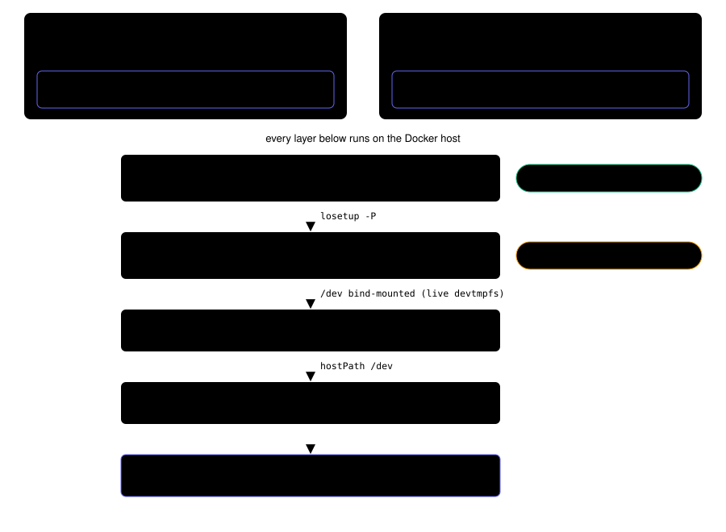

:::danger[Run this on a virtual machine, not on your workstation]
Ceph puts block devices, filesystems and their kernel threads in **the Docker host's kernel**. On macOS that is any of the VM's available for supporting Docker/Containers (Docker for Desktop, Colima, Podman etc), so a mistake costs only a reboot of the VM. On a Linux workstation the Docker host is the machine itself, and two things follow: a stuck RBD mapping is an unkillable kernel thread on that machine, clearable without **a reboot** only if the StorageClass bounded its I/O, and the privileged k3d node enumerates your real drives.

Rook says the same: *"Always use a virtual machine when testing Rook. Never use your host system where local devices may mistakenly be consumed."*

`storage-disks attach` refuses on a non-virtual host for that reason. If you accept the risk, override it with `ALLOW_BARE_METAL=1` or `--allow-bare-metal` — but the safe answer on Linux is to run Docker inside a VM, which is the property macOS gets for free.
:::

A k3d node has no raw block devices, so a storage plugin that needs one cannot run locally. `deploy/k3d/storage-disks.sh` provides them as loop-backed partitions. Rook Ceph is the first consumer and shapes some of the requirements below, but the disks themselves are generic.



## Quick start

```bash
cd plugins
just cluster-create-storage        # binds the host block devices in
just storage-disks doctor          # check the kernel Docker runs on
just storage-disks attach          # creates /dev/loop0p1 .. /dev/loop2p1
```

Then verify the disks really work, independently of any plugin:

```bash
../deploy/k3d/rook-smoke.sh up     # upstream Rook chart + a minimal CephCluster
../deploy/k3d/rook-smoke.sh status # expect HEALTH_OK
../deploy/k3d/rook-smoke.sh test   # 1Gi PVC + a pod that writes to it -> SMOKE-OK
../deploy/k3d/rook-smoke.sh down   # frees the rook-ceph namespace
```

`rook-smoke.sh` uses no fundament code, so it separates a broken environment from a broken plugin.

## Requirements

The cluster must bind `/dev` and `/run/udev` into its node, which is off by default so a cluster only exposes the host's devices when someone is working on storage: use `just cluster-create-storage` instead of `just cluster-create`. Docker fixes a container's mounts at creation, so an existing cluster has to be recreated — `just cluster-delete && just cluster-create-storage`.

Neither bind is optional. Without `/dev` the OSDs come up and Ceph reports `HEALTH_OK`, but no PVC can mount: a node container's `/dev` is a private tmpfs rather than the kernel's devtmpfs, so the `/dev/rbdN` that Ceph CSI creates when it maps a volume never appears there. Ceph checks for exactly this and says so — `rbd: mapping succeeded but /dev/rbd0 is not accessible, is host /dev mounted?` (`ceph/src/krbd.cc`, `do_map`). There is no way around it: rbd-nbd has the same dependency, and Rook's own RBD node plugin hardcodes a hostPath mount of `/dev`.

`/run/udev` is mounted because Rook mounts it into every OSD pod, the prepare job and the discover daemon, and it is a documented prerequisite from Rook v1.20 on. Running without it here wedged the prepare job with a process in uninterruptible I/O wait; the cause was not established, and the plausible explanations point at device probing rather than at udev itself.

Defaults are 3 disks of 20 GiB, sparse, overridable with `DISK_COUNT` and `DISK_SIZE`. Three is the useful floor: it is what lets a pool hold 3 replicas across OSDs. BlueStore reserves several GiB of overhead, so do not go below 10 GiB per disk.

Ceph needs roughly 2 GiB per OSD plus its own daemons, so give the VM at least 8 GiB — on colima, `colima start --cpus 4 --memory 8`. Memory cannot be changed on a running VM.

## After a reboot

The backing files are ordinary files on the Docker data disk, so they survive a Docker daemon restart, a VM restart and a laptop reboot. The loop devices do not — those are kernel state. Recovery is `just storage-disks attach`, and nothing else: `/dev` is bound into the node as a live devtmpfs, so the devices reappear there immediately.

## Stopping a cluster that has Ceph volumes mounted

Stopping the cluster kills the OSDs while the kernel still has the volume mapped, so the filesystem's journal thread blocks forever on a device that will never answer. The node container then cannot be stopped and cannot be entered.

`just cluster-stop` handles this by itself: a mapped device is the signal that storage is in play, so it evicts the Ceph consumers first — while Ceph is still up to service the unmounts — and skips straight to stopping when nothing is mapped. `just cluster-delete` does the same. Nothing extra to remember, and a cluster that never used storage pays nothing. Nothing can intercept `k3d cluster stop` run directly, a `docker stop`, a `kill -9` or closing the laptop lid. For those the StorageClass sets `mapOptions: "krbd:osd_request_timeout=90"`, which turns krbd's endless retry into an I/O error and so keeps the filesystem's journal thread out of uninterruptible sleep. It is deliberately dev-only: it aborts *all* requests once they exceed the timeout, which is the wrong trade for a real cluster.

That bounds the damage without removing it. Measured on the bypass path: the filesystem unmounts, but the mapping stays and the node container will not exit — `k3d cluster stop` fails at its own 30s timeout, repeated `docker stop` calls fail too, and the node can no longer be entered. What holds it is a kernel worker retrying the rbd watch, a wait with no timeout of its own. Removing the device ends it:

```bash
just storage-disks unmap-stale
```

The container then stops immediately, and a normal start brings the cluster back with its data intact. This works only because the timeout already aborted the in-flight I/O; without it the removal blocks for the same reason `rbd unmap -o force` does, and only restarting the host clears it.

After any restart, an OSD can come back with a PG stuck in `laggy`, which blocks reads on it indefinitely while `ceph -s` reports `slow ops` and the OSD itself shows no latency. Restart that OSD's deployment.

## Cleaning up

Nothing removes the images on its own — `k3d cluster delete` knows nothing about the volume, and `reset` deletes them only to recreate them empty. `just storage-disks purge` detaches and deletes the volume, which is the only way to get the space back. This matters more on Linux than on macOS, where deleting the VM takes the disks with it.

Deleting an image while its loop device is still attached frees nothing, because the kernel keeps the deleted inode alive until the device goes away. `purge` and `reset` therefore refuse while anything still holds a device; stop the consumer first.

Use `just storage-disks reset` to start over from clean disks, which is needed after deleting the cluster: the images keep their on-disk state while the node that referenced them is gone.

The volume is never attached to a container, so Docker counts it as unused: `docker volume prune -a` and `docker system prune --volumes` will delete the images. Plain `docker volume prune` will not, as it only removes anonymous volumes.

## Only ever select /dev/loopNpN

A k3d node container is privileged, and Docker populates its `/dev` with **every** device on the Docker host, so the node can open the host's real disks with or without the `/dev` bind. On macOS those are the VM's virtual disks; on a Linux desktop they are the machine's own drives. They also reach Rook's discover ConfigMap, so nothing at the Rook layer filters them out.

Whatever consumes these disks must therefore restrict itself to the loop partitions rather than trusting discovery. One consequence on Linux: any loop partition qualifies, including one backing an unrelated disk image you attached yourself with `losetup -P`.

## Docker backends

Loop devices and kernel modules live in the kernel the Docker daemon runs on: the VM on macOS, the machine itself on Linux. The helper reaches it the same way everywhere, with `docker run --privileged --pid=host … nsenter -t 1`, so no backend-specific shell is needed. Use `--native` for rootless Docker, where the container's PID 1 is not the host's.

What varies between backends is kernel module availability, which is what `doctor` reports.

| Backend | `rbd` / `ceph` modules |
|---|---|
| colima | verified present (Ubuntu 24.04 base `linux-modules`) |
| Rancher Desktop | Alpine `linux-virt` ships them, but the ISO is minimized — run `doctor` |
| Docker Desktop | its kernel is built by Docker — run `doctor`. Enhanced Container Isolation blocks `--privileged`, and then this does not work at all |
| OrbStack | custom kernel, undocumented — run `doctor` |
| Linux desktop | distro kernels ship `rbd` in the standard modules package |

A missing `rbd` module does not stop the disks working. Ceph OSDs write to the block device directly and never use it; only `csi-rbdplugin` crash-loops, so RBD PVCs fail to mount. It fatals at startup before reading a StorageClass, so `mounter: rbd-nbd` does not help. If you need working PVCs on such a backend, use colima.

If you run an unlisted backend, run `doctor` and report the result.

Ceph's reef (v18.x) arm64 images segfault on startup — `ceph-osd --version` exits 139 in a plain `docker run` — so anything running Ceph here needs v19 or newer.

## Why partitions and not bare loop devices

`rook-discover` does not report bare loop devices, so a `/dev/loopN` never reaches the ConfigMap Rook consumers read. Partitions are reported as `type=part`, which it accepts, so each image is attached with partition scanning and given a single GPT partition.

The partition exists for discovery alone. OSD provisioning takes a bare loop device once the operator has `allowLoopDevices=true`, which is what `rook-smoke.sh` relies on — it names devices explicitly and never consults the inventory. The partition is needed only by a consumer that discovers disks rather than being told about them, as the `ceph-rook` plugin does. Note also that `type=part` puts these devices back in scope for `useAllDevices`, which excludes loop devices deliberately, so that setting must stay false.

The cause is an upstream defect rather than a design decision. Rook gates the device-type allowlist on an environment variable — `pkg/clusterd/disk.go:50` calls `getAllowLoopDevices()`, which reads `CEPH_VOLUME_ALLOW_LOOP_DEVICES` (`disk.go:256-258`) — and the operator injects that variable into the discover DaemonSet when `controller.LoopDevicesAllowed()` is true (`pkg/operator/discover/discover.go:236-238`). Here the operator ConfigMap contains `ROOK_CEPH_ALLOW_LOOP_DEVICES: true` while the DaemonSet has no such variable, so the allowance never reaches the daemon that needs it. Setting it by hand with `kubectl -n rook-ceph set env ds/rook-discover CEPH_VOLUME_ALLOW_LOOP_DEVICES=true` makes an unpartitioned device appear as `type=loop empty=True`.

It is an ordering bug, not a race. `pkg/operator/ceph/controller.go` builds the discover DaemonSet at line 129 and only then calls `SetAllowLoopDevices` at line 134 — the sole non-test caller of the global that `discover.go` reads. Because the DaemonSet is created-or-updated, an operator restart also strips the variable from an existing DaemonSet on its first reconcile; it reappears on the next one, so the setting looks intermittent while the cause is deterministic. The ordering is unchanged through Rook `master`, so upgrading does not help, and no upstream issue reports it.

Partitioning is kept because it is self-contained: the alternative depends on patching a resource the operator owns, after it creates it, and having that patch removed again on the next operator restart.
